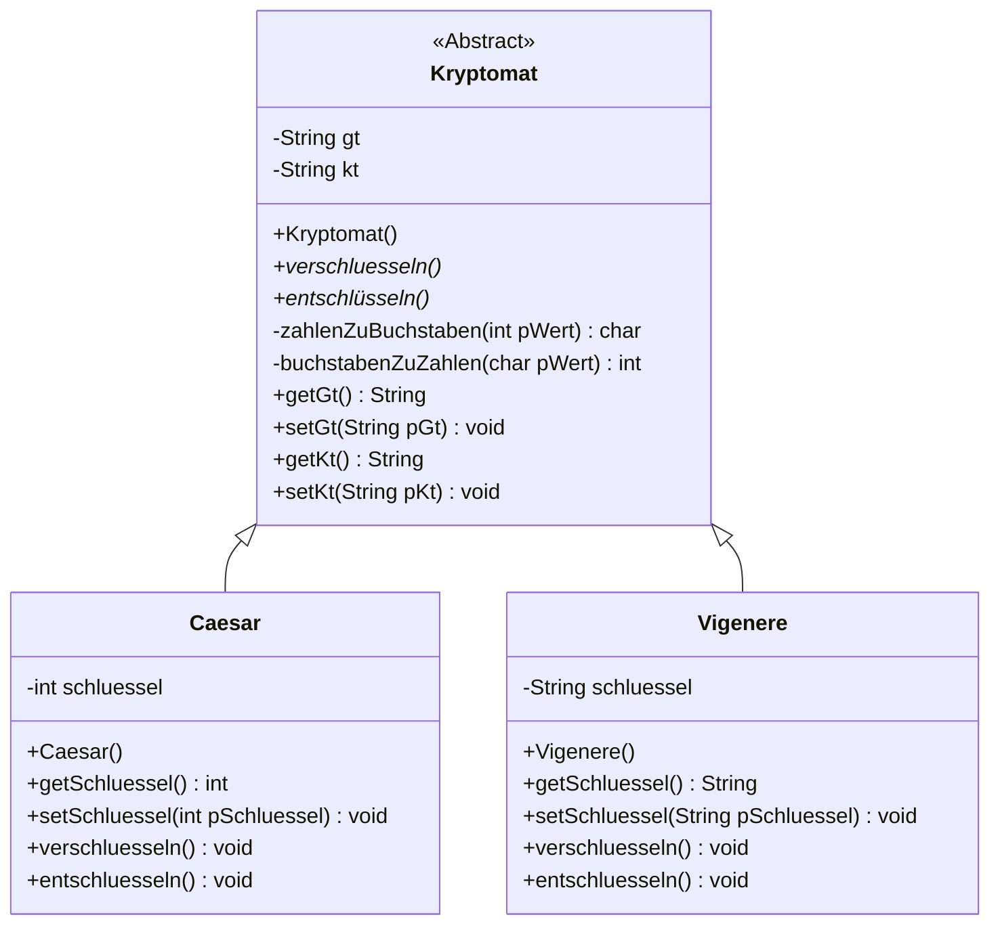

# Test Site

```mermaid
classDiagram
    Kryptomat <|-- Caesar
    Kryptomat <|-- Vigenere
    <<Abstract>> Kryptomat
    Kryptomat: -String gt
    Kryptomat: -String kt
    Kryptomat: +Kryptomat()
    Kryptomat: +verschluesseln()*
    Kryptomat: +entschlüsseln()*
    Kryptomat: -zahlenZuBuchstaben(int pWert) char
    Kryptomat: -buchstabenZuZahlen(char pWert) int
    Kryptomat: +getGt() String
    Kryptomat: +setGt(String pGt) void
    Kryptomat: +getKt() String
    Kryptomat: +setKt(String pKt) void

    class Caesar{
      -int schluessel
      +Caesar()
      +getSchluessel() int
      +setSchluessel(int pSchluessel) void 
      +verschluesseln() void
      +entschluesseln() void
    }
    class Vigenere{
      -String schluessel
      +Vigenere()
      +getSchluessel() String
      +setSchluessel(String pSchluessel) void
      +verschluesseln() void
      +entschluesseln() void
    }
```
