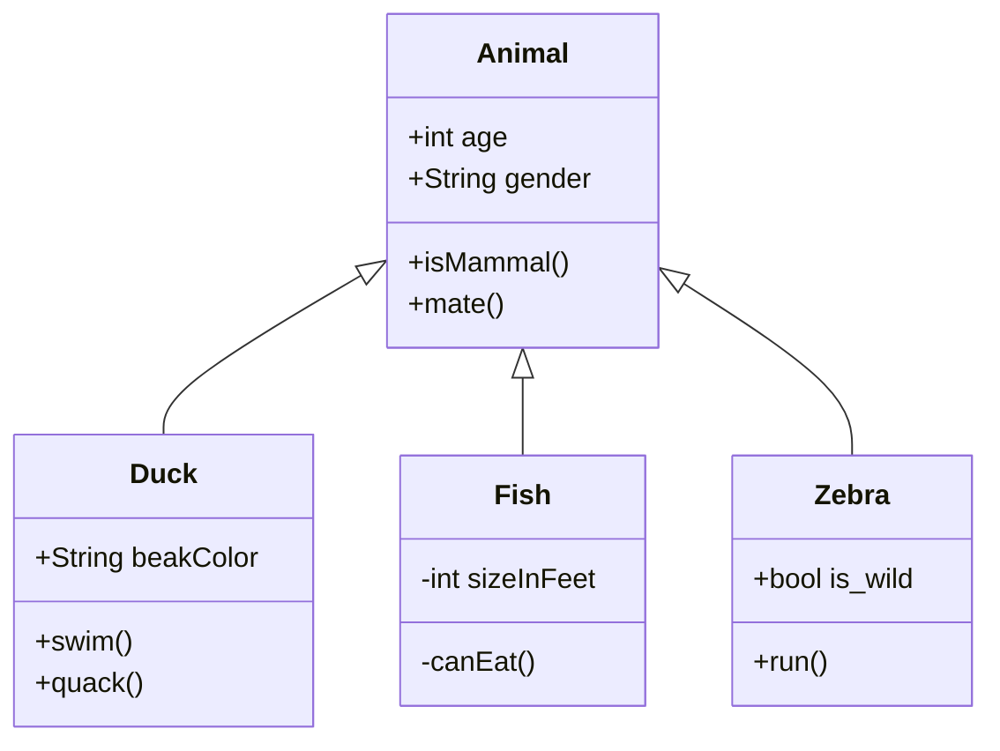

# Mermaid

[Mermaid](https://mermaid-js.github.io/mermaid) ermöglicht dir das Erstellen von Diagrammen und Visualisierung durch eine deklarative Sprache.

````mermaid-js

````

Diese Syntax ist kompatibel mit GitHub, GitLab und anderen. Wir haben noch eine
zweite Variante hinzugefügt, damit diese Syntax mehr den Erweiterungen von
Hyperbook ähnelt. Du kannst frei entscheiden, welche du verwenden möchtest.

```mermaid-js
:::mermaid
classDiagram
    Animal <|-- Duck
    Animal <|-- Fish
    Animal <|-- Zebra
    Animal : +int age
    Animal : +String gender
    Animal: +isMammal()
    Animal: +mate()
    class Duck{
      +String beakColor
      +swim()
      +quack()
    }
    class Fish{
      -int sizeInFeet
      -canEat()
    }
    class Zebra{
      +bool is_wild
      +run()
    }
:::
```


