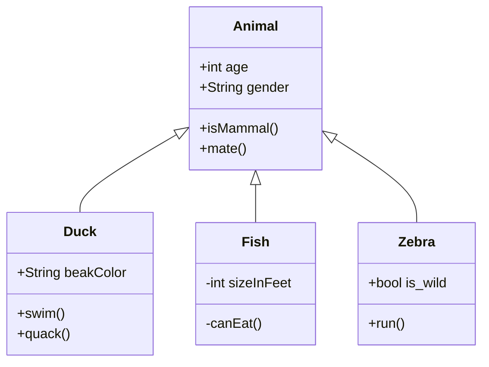

# Mermaid

[Mermaid](https://mermaid-js.github.io/mermaid) lets you create diagrams and visualizations using text and code.

````mermaid-js

````

This syntax is in line with the approach GitHub, GitLab and other have
implemented. But we also provide a second syntax for using mermaid diagrams,
which is more in line with the other elements of hyperbook. Both support the
same features, therefore it comes down to your preferences and if you want
cross-compatability with GitHub, GitLab and others.

```mermaid-js
:::mermaid
classDiagram
    Animal <|-- Duck
    Animal <|-- Fish
    Animal <|-- Zebra
    Animal : +int age
    Animal : +String gender
    Animal: +isMammal()
    Animal: +mate()
    class Duck{
      +String beakColor
      +swim()
      +quack()
    }
    class Fish{
      -int sizeInFeet
      -canEat()
    }
    class Zebra{
      +bool is_wild
      +run()
    }
:::
```


